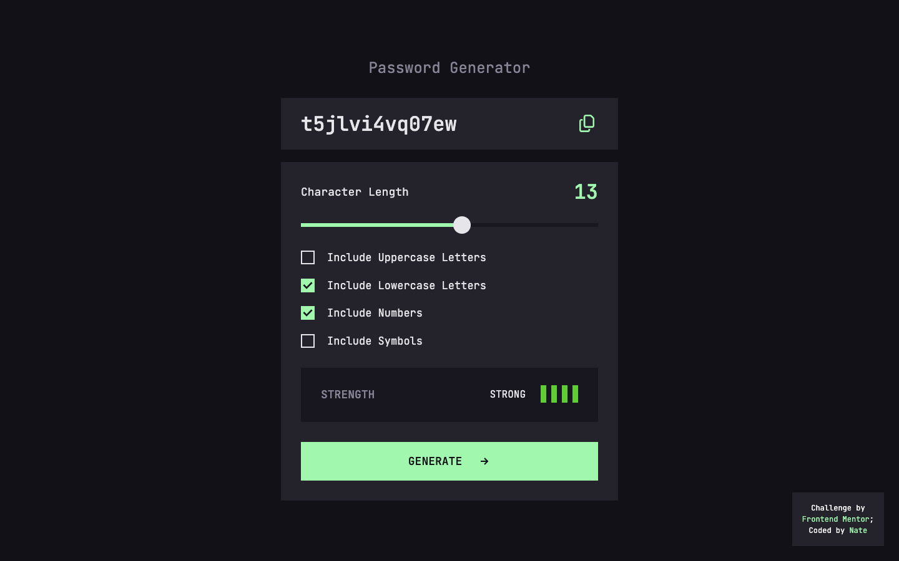

# Password Generator

[](https://app.netlify.com/sites/ntjnh-password-generator/deploys)

This is a front end challenge that mostly follows the [Frontend Mentor challenge](https://www.frontendmentor.io/challenges/password-generator-app-Mr8CLycqjh) but because it's a premium challenge, I don't have full access to everything I need to I've improvised! Frontend Mentor challenges help you improve your coding skills by building realistic projects.

## Table of contents

- [Overview](#overview)
  - [Brief](#brief)
  - [Screenshot](#screenshot)
  - [Links](#links)
- [My process](#my-process)
  - [Built with](#built-with)
  - [What I learnt](#what-i-learnt)
  - [Continued development](#continued-development)
  - [Useful resources](#useful-resources)
- [Author](#author)

## Overview

### Brief

Your challenge is to build out this password generator app and get it looking as close to the design as possible.

You can use any tools you like to help you complete the challenge. So if you've got something you'd like to practice, feel free to give it a go.

Your users should be able to:

- Generate a password based on the selected inclusion options
- Copy the generated password to the computer's clipboard
- See a strength rating for their generated password
- View the optimal layout for the interface depending on their device's screen size
- See hover and focus states for all interactive elements on the page

### Screenshot



### Links

- Solution URL: [GitHub repo](https://github.com/ntjnh/password-generator)
- Live Site URL: [ntjnh-password-generator.netlify.app](https://ntjnh-password-generator.netlify.app)

## My process

### Built with

- [React](https://reactjs.org/)
- [SASS](https://sass-lang.com/)
- Mobile-first workflow

### What I learnt

This project has beena huge learning experience for me. I think I had about three different ways to generate passwords but the first two weren't quite right so it took a lot of thinking and scribbling of handwritten notes before I finally found a solid technique. The main issue at first was that the character selection was too random so there'd be instances where if you'd ticked lowercase letters, symbols and numbers, you could get a password that didn't have any numbers or any symbols and so on.

The second version was just as insane. I don't think I even implemented it fully because I knew it was ridiculous. Something like looping `passwordLength` times then grabbing a character from each "pool" at a time. That wouldn't have been random enough. I would've always had equal amounts of characters for each type e.g. 8-character password with 2 uppercase letters, 2 lowercase letters, 2 symbols and 2 numbers.

I eventually got there with attempt number 3. I loop through the array of selected character types and get a random character from each one to make sure I have at least one of each. Then I create an array of ALL the available characters and then get the remaining `password length minus number of selected character types` characters from random indexes in that array. Snippet below shows the implementation: 

```js
// Loop through the selected character types
typesArr.forEach(t => {

    // Add all characters to the available characters array
    characters[t].forEach(char => availableCharacters.push(char))
    
    // get a character from each type to make sure we have at least one of each
    passwordCharacters.push(getCharacter(characters[t]))
})

// Calculate how many more characters are needed
const remainingCharacters = passwordLength - typesArr.length

// Loop to grab the remaining characters based on number above
for (let x = 0; x < remainingCharacters; x++) {
    passwordCharacters.push(getCharacter(availableCharacters))
}
```

I've learnt so much more about how to use state, event handlers and props with parent and child components. This was especially useful when I couldn't figure out how to update and access the state variable for the generated password from two separate components. The official React documentation has been really helpful to me for this project.

I also gained some very useful knowledge about clipboard and how to read and write data to it. I've seen it out in the wild many times before but never thought about how it was implemented until now.

### Continued development

The initial build is done but there are still various bugs I need to squash. These are mainly to do with form validation:

- [ ] At least one character type must be selected
    - [ ] Checkbox borders should change to red until a box is checked
- [ ] Password length needs to be more than or equal to 1 
- [ ] It shouldn't be possible to select more character types than the length of the password

### Useful resources

- [Reading the input values when submitting a form](https://react.dev/reference/react-dom/components/input#reading-the-input-values-when-submitting-a-form) - This helped me when I needed to get the selected character types to then generate a password.
- [Sharing State Between Components](https://react.dev/learn/sharing-state-between-components) - I found this useful in figuring out how to access a state variable from two  sibling components.
- [Clipboard API](https://developer.mozilla.org/en-US/docs/Web/API/Clipboard_API) - Reading through this helped me to understand how the clipboard works and how I could use the API to read or write data to a user's clipboard.
- [Clipboard: writeText() method](https://developer.mozilla.org/en-US/docs/Web/API/Clipboard/writeText) - This helped me to add text to a user's clipboard.
- [LastPass Password Generator](https://www.lastpass.com/features/password-generator) - I used this password generator for a bit of functionality inspiration

## Author

- Website - [Nate](https://natejonah.com)
- Frontend Mentor - [@ntjnh](https://www.frontendmentor.io/profile/ntjnh)
- Twitter - [@natejonah](https://www.twitter.com/natejonah)
